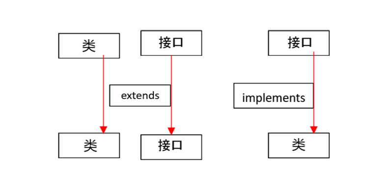

# java核心技术卷12th

## 类&&接口关系
类和类继承，类通过`extends`继承其它类，单继承，每个类只能继承一个父类，但可以通过继承链层层扩展功能，可以避免菱形继承问题。
接口和接口继承，接口通过`extends`继承其它接口，多继承  
类实现接口，类通过`implements`实现接口，一个类可以实现多个接口  
`class Dog extends Animal implements Pet`  
接口的多重继承
```java
interface Animal {  // 第一个接口
    void eat();
}
interface Pet {  // 第二个接口
    void play();
}
interface DogActions extends Animal, Pet {  // 多重继承
    void bark();
}
class Dog implements DogActions {  // 实现接口
    @Override
    public void eat() {
        System.out.println("Dog is eating...");
    }

    @Override
    public void play() {
        System.out.println("Dog is playing...");
    }

    @Override
    public void bark() {
        System.out.println("Dog is barking...");
    }
}
public class Test {
    public static void main(String[] args) {
        Dog dog = new Dog();
        dog.eat();
        dog.play();
        dog.bark();
    }
}
// 网络图片

```

1. 类（class）：类是一种抽象的概念，它代表一个具体的实体（对象），类是用来描述对象行为（方法）和数据（字段）的。

2. 接口（interface）：接口是一种抽象的概念，它定义了一个类的行为（方法）和数据（字段），但是不包含实现细节，接口只是一个抽象的描述，需要由其他类来实现。

## 什么是Lambda表达式？
Lambda表达式是一种匿名函数，它允许我们将行为（函数）作为参数传递。可以把Lambda表达式理解为一段可以传递的代码，这段代码的核心就是一个函数。

## Java中Lambda表达式的基本语法
基本语法：
```java
(parameters) -> { statements }
```

## Lambda表达式的简单例子

1. 不带参数的Lambda表达式：
```java
() -> System.out.println("Hello World")
```

2. 带一个参数的Lambda表达式：
```java
name -> System.out.println("Hello " + name)
```

3. 带多个参数的Lambda表达式：
```java
(x, y) -> x + y
```

## 实际应用示例

1. 集合排序
```java
List<String> names = Arrays.asList("Alice", "Bob", "Charlie");
// 传统方式
Collections.sort(names, new Comparator<String>() {
    @Override
    public int compare(String a, String b) {
        return b.compareTo(a);
    }
});

// Lambda表达式方式
Collections.sort(names, (a, b) -> b.compareTo(a));
```

2. 事件处理
```java
// 传统方式
button.addActionListener(new ActionListener() {
    @Override
    public void actionPerformed(ActionEvent e) {
        System.out.println("Button clicked!");
    }
});

// Lambda表达式方式
button.addActionListener(e -> System.out.println("Button clicked!"));
```

3. Stream操作
```java
List<Integer> numbers = Arrays.asList(1, 2, 3, 4, 5);
// 使用Lambda表达式过滤偶数并打印
numbers.stream()
       .filter(n -> n % 2 == 0)
       .forEach(n -> System.out.println(n));
```

## Lambda表达式的优点

1. **代码简洁**：不需要编写完整的匿名类
2. **可读性更强**：直观地表达代码意图
3. **功能性编程**：支持将函数作为参数传递
4. **延迟执行**：可以延迟执行特定代码块

## 使用场景

1. 集合操作（排序、过滤、映射等）
2. 多线程编程
3. 事件处理
4. Stream API操作
5. 函数式接口实现

## 注意事项

1. Lambda表达式只能用于函数式接口（只有一个抽象方法的接口）
2. Lambda表达式中引用的外部变量必须是final或effectively final
3. Lambda表达式中的this关键字指向包含Lambda表达式的类